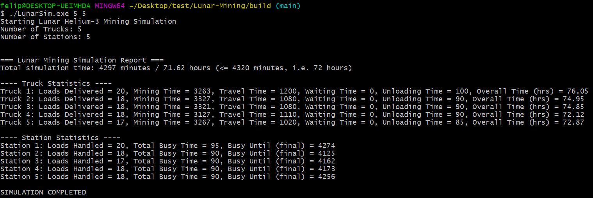

## Lunar Mining Simulator

Task is to develop a C++ simulation for a lunar Helium-3 space mining operation. This
simulation will manage and track the efficiency of mining trucks and unload stations over a
continuous 72-hour operation.

## Key Components

**Mining Trucks:** These vehicles perform the actual mining tasks.

**Mining Sites:** Locations on the moon where the trucks extract Helium-3. Assume an infinite
number of sites, ensuring trucks always have access to mine without waiting.

**Mining Unload Stations:** Designated stations where trucks unload the mined Helium-3. Each
station can handle one truck at a time.

## Simulation Requirements:

The simulation must be configurable to accommodate various numbers of mining trucks (m)
and unload stations (n).

Calculate and report statistics for the performance and efficiency of each mining truck and
unload station.

The simulation represents 72 hours of non-stop mining and must execute faster than
real-time to provide timely analysis.

## Run Executable Program

Go to `build/` directory within the project: 

`cd build`

Execute the code with this command (defaults to 4 trucks, 3 stations):

`./LunarSim.exe` (defaults to 4 trucks, 3 stations)

or

Execute custom values of (m = 5) trucks, and (n = 5) stations:

`./LunarSim.exe 5 5` 

## Design Choices and Considerations

- **Object-Oriented Design:** Implemented three primary classes—`MiningTruck`, `MiningStation`, and `Simulation`—to encapsulate distinct functionalities.
- **Composition Relationship:** The `Simulation` class has instances of `MiningTruck` and `MiningStation`, managing their interactions and lifecycle.
- **Naming Conventions:** 
  - **Public Methods/Variables:** Uppercase first letter with a trailing underscore (e.g., `GetTruckID_()`).
  - **Private Methods/Variables:** Lowercase with a trailing underscore (e.g., `truckid_`).
- **Efficiency Considerations:** I considered using smart pointers for events to avoid copies, but since each process is small, copying is simpler and efficient enough. If I were to scale up this simulation, i’d switch to std::shared_ptr<Process>.
- **Process Queue:** Utilized a priority queue (`std::priority_queue`) to efficiently process events based on their scheduled times.

`std::priority_queue<MiningProcess::Process_, std::vector<MiningProcess::Process_>, std::greater<MiningProcess::Process_>> eventQueue_;`

**Time_:** The scheduled time for the event (in minutes).

**TruckID_:** The identifier of the truck involved in the event.

**Type_:** The type of event (e.g., FINISH_MINING, ARRIVE_STATION, FINISH_UNLOADING).

## Dependencies

The project uses Conan for dependency management and Google Test for unit testing.

## Prerequisites For Conan

Ensure the following tools are installed on your system:

**CMake:** Version 3.15 or higher

**Conan:** Version 2.x

## Compiling The Code For Testing (Using Conan)

`cd ../Lunar-Mining/build/`

`conan install .. --build=missing -s build_type=Debug`

`cmake .. -DCMAKE_TOOLCHAIN_FILE=conan_toolchain.cmake -DCMAKE_BUILD_TYPE=Debug`

`cmake --build .`

Execute the code with this command (defaults to 4 trucks, 3 stations):

`./Debug/lunar_mining_app.exe` 

Execute custom values of (m = 5) trucks, and (n = 6) stations:

`./Debug/lunar_mining_app.exe 5 6` 

Execute the code tests with this command:

`./Debug/lunar_mining_tests.exe` 

